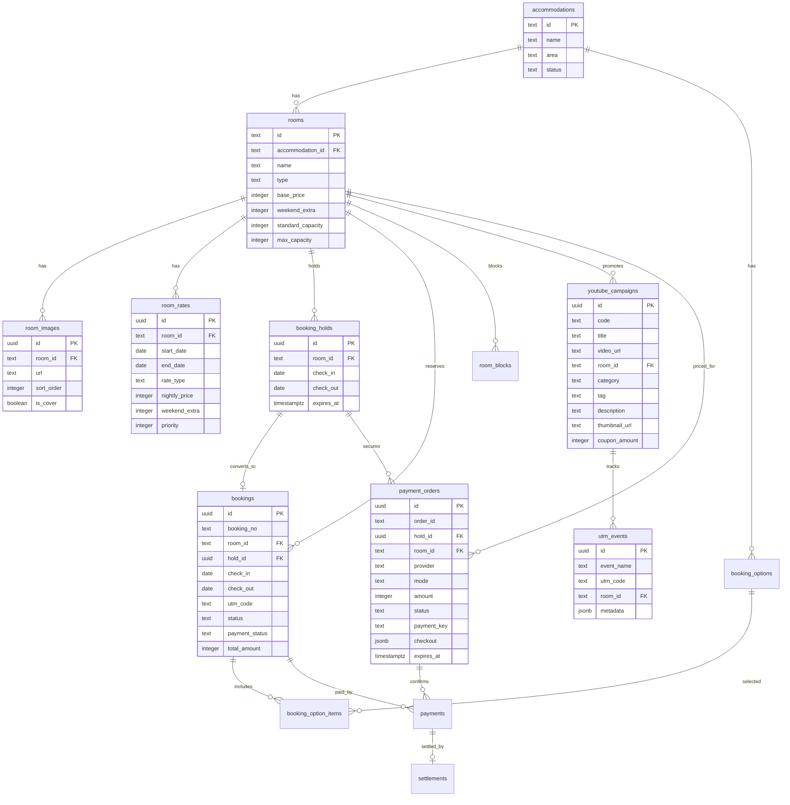

# DB ERD 초안

```mermaid
erDiagram
  accommodations ||--o{ rooms : has
  rooms ||--o{ room_images : has
  rooms ||--o{ room_rates : has
  accommodations ||--o{ booking_options : has
  rooms ||--o{ booking_holds : holds
  booking_holds ||--o| bookings : converts_to
  rooms ||--o{ bookings : reserves
  bookings ||--o{ booking_option_items : includes
  booking_options ||--o{ booking_option_items : selected
  rooms ||--o{ room_blocks : blocks
  rooms ||--o{ youtube_campaigns : promotes
  youtube_campaigns ||--o{ utm_events : tracks
  booking_holds ||--o{ payment_orders : secures
  rooms ||--o{ payment_orders : priced_for
  bookings ||--o{ payments : paid_by
  payment_orders ||--o{ payments : confirms
  payments ||--o| settlements : settled_by

  accommodations {
    text id PK
    text name
    text area
    text status
  }

  rooms {
    text id PK
    text accommodation_id FK
    text name
    text type
    integer base_price
    integer weekend_extra
    integer standard_capacity
    integer max_capacity
  }

  room_images {
    uuid id PK
    text room_id FK
    text url
    integer sort_order
    boolean is_cover
  }

  room_rates {
    uuid id PK
    text room_id FK
    date start_date
    date end_date
    text rate_type
    integer nightly_price
    integer weekend_extra
    integer priority
  }

  booking_holds {
    uuid id PK
    text room_id FK
    date check_in
    date check_out
    timestamptz expires_at
  }

  bookings {
    uuid id PK
    text booking_no
    text room_id FK
    uuid hold_id FK
    date check_in
    date check_out
    text utm_code
    text status
    text payment_status
    integer total_amount
  }

  youtube_campaigns {
    uuid id PK
    text code
    text title
    text video_url
    text room_id FK
    text category
    text tag
    text description
    text thumbnail_url
    integer coupon_amount
  }

  utm_events {
    uuid id PK
    text event_name
    text utm_code
    text room_id FK
    jsonb metadata
  }

  payment_orders {
    uuid id PK
    text order_id
    uuid hold_id FK
    text room_id FK
    text provider
    text mode
    integer amount
    text status
    text payment_key
    jsonb checkout
    timestamptz expires_at
  }
```

## 접근 정책

- 고객 공개 조회: 숙소, 방/사이트, 이미지, 요금, 옵션, 활성 유튜브 캠페인
- 고객 공개 입력: UTM 이벤트
- 예약/결제/정산: 서버 API와 service role로만 처리
- 운영자 API: `x-admin-token` 임시 가드, 추후 Supabase Auth 기반 권한으로 전환
